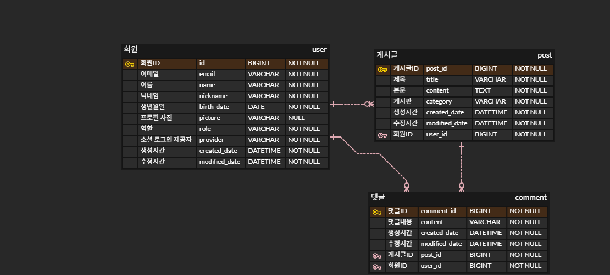

# JPOP 블로그 프로젝트

> 일본 음악 팬들을 위한 커뮤니티 블로그 서비스  
> Spring Boot 기반 백엔드 + Thymeleaf 프론트엔드 구현

---

## 📌 목차
- [1. 프로젝트 소개](#프로젝트-소개)
- [2. 배포 사이트](#배포-사이트)
- [3. 기술 스택](#기술-스택)
- [4. 프로젝트에 도입한 기술들](#프로젝트에-도입한-기술들)
- [5. 실행 화면](#실행-화면)
- [6. 시스템 설계](#시스템-설계)
- [7. 추가 기능 개발](#추가-기능-개발)

---

## 프로젝트 소개
>JPOP 음악 팬들을 위한 커뮤니티 서비스로,  
회원들은 자유롭게 글을 작성하고 댓글을 달며 소통할 수 있습니다. 
처음으로 진행하는 개인 프로젝트입니다. 
아직 매우 많이 부족한 상태입니다. 
피드백 주시면 감사하겠습니다.
---
## 배포 사이트
[JPOPJ](https://jpopj.com)

---
## 기술 스택

| 분류              | 기술                                          |
|-----------------|---------------------------------------------|
| Language        | Java 17                                     |
| Framework       | Spring Boot, Spring Security, JPA           |
| Database        | MySQL, ~~Redis~~                            |
| Build Tool      | Gradle                                      |
| Frontend        | Thymeleaf, html/css, js                     |
| Deployment      | AWS EC2, RDS, ~~S3~~, ~~Docker~~, ~~Nginx~~ |
| Version Control | Git, GitHub                                 |
| CI/CD           | GitHub Actions                              |
| Messaging       | ~~Kafka~~                                   |
 
###### 취소선으로 표시된 기술 스택은 현재 적용되지는 않았지만, 추후 도입을 계획하고 있는 기술입니다.

---
## 프로젝트에 도입한 기술들
- AWS EC2 배포하기
- AWS RDS로 MySQL 서버 띄우기
- EC2 인스턴스에 Elastic IP 연결하기
- 리버스 프록시(Nginx)로 포트 포워딩하기
- 개인 도메인 구매(jpopj.com) 후 Elastic IP 연결하기
- Github Action으로 CI/CD 구축하기

---
## 실행 화면

게시판 목록

게시글 작성
 

사용자 정보

게시글 및 댓글

---

## 시스템 설계

### 1. ERD 설계

###### 최종 ERD가 아니며 도메인을 추가하며 변경할 예정입니다.

### 2. API 설계

---
## [추가 기능 개발](https://long-feather-730.notion.site/23da987f6c4080fcb932ed9eb2f8390e)
###### 앞으로도 기능을 지속적으로 확장해 나갈 예정입니다.

추가 기능 개발

 - [post 도메인 엔티티 리펙토링](https://long-feather-730.notion.site/Post-23da987f6c4080709982f0ef7a71da63)

 - [User 엔티티에 Nickname VO 추가하기](https://www.notion.so/User-Nickname-VO-23da987f6c4080b7a00ef6b9adc971ff)

 - [소셜 로그인 후 추가 정보 입력받기](https://www.notion.so/23fa987f6c40808b98fef34bdffb62ae)

 - [★★★Spring Security 로그아웃 동작원리 분석★★★](https://long-feather-730.notion.site/23fa987f6c40804cbd7eed2aaa24fe5f?pvs=74)

 - [커스텀 ArgumentResolver로 컨트롤러 중복 코드 리팩토링하기](https://long-feather-730.notion.site/ArgumentResolver-240a987f6c4080d6962cf83941d44216?pvs=74)

 - [네이버 OAuth2 로그인 기능 추가하기](https://long-feather-730.notion.site/OAuth2-240a987f6c408033b6fadb30f4bf0629)

 - [OAuth2 로그인 시, 구글 계정 선택 항상 다시 물어보게 만들기](https://long-feather-730.notion.site/OAuth2-248a987f6c4080d6b4c7ef73e014e91a)

 - [게시물 삭제 기능 만들기](https://long-feather-730.notion.site/250a987f6c4080838b8bfabcb4a807fe?pvs=74)

