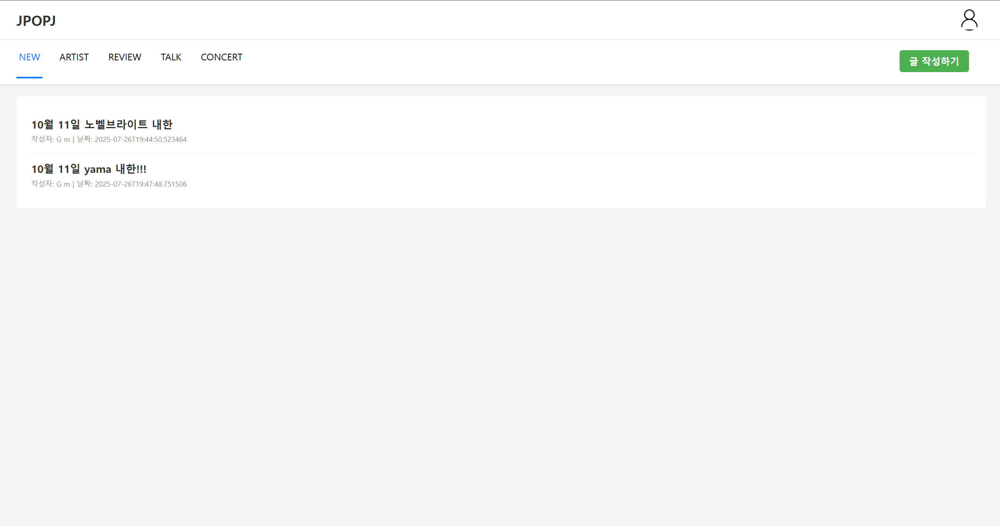
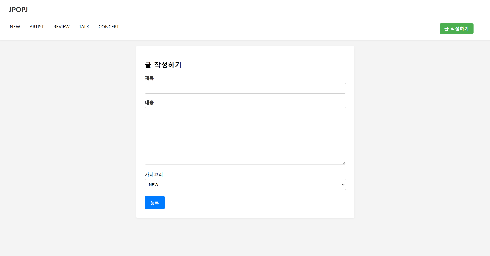
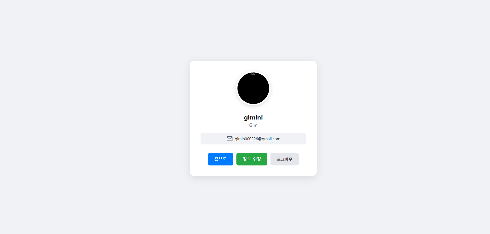
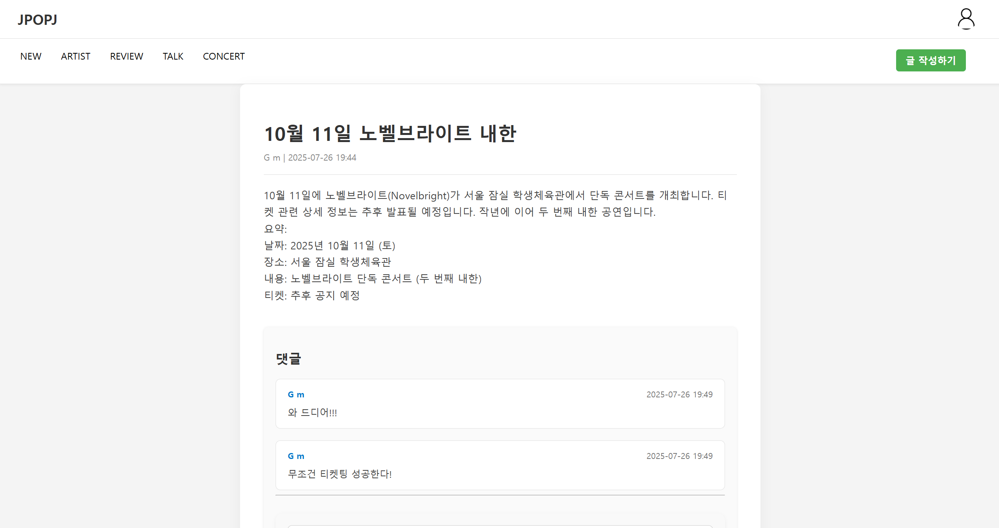

# JPOP 블로그 프로젝트

> 일본 음악 팬들을 위한 커뮤니티 블로그 서비스  
> Spring Boot 기반 백엔드 + Thymeleaf 프론트엔드 구현

---

## 📌 목차
- [1. 프로젝트 소개](#프로젝트-소개)
- [2. 주요 기능](#주요-기능)
- [3. 기술 스택](#기술-스택)
- [4. 실행 화면](#실행-화면)
- [5. 시스템 설계](#시스템-설계)
- [6. 추가로 개발할 기능](#추가로-개발할-기능)
- [7. 추가로 적용할 기술](#추가로-적용할-기술)

---

## 프로젝트 소개
>JPOP 음악 팬들을 위한 커뮤니티 서비스로,  
회원들은 자유롭게 글을 작성하고 댓글을 달며 소통할 수 있습니다.
처음으로 진행하는 개인 프로젝트입니다.
피드백 주시면 감사하겠습니다.
---
## 배포 사이트
[JPOPJ](https://jpopj.com)

---

## 기술 스택

| 분류              | 기술                                          |
|-----------------|---------------------------------------------|
| Language        | Java 17                                     |
| Framework       | Spring Boot, Spring Security, JPA           |
| Database        | MySQL, ~~Redis~~                            |
| Build Tool      | Gradle                                      |
| Frontend        | Thymeleaf, html/css, js                     |
| Deployment      | AWS EC2, RDS, ~~S3~~, ~~Docker~~, ~~Nginx~~ |
| Version Control | Git, GitHub                                 |
| CI/CD           | GitHub Actions                              |
| Messaging       | Kafka                                       |
 
###### 취소선으로 표시된 기술 스택은 현재 적용되지는 않았지만, 추후 도입을 계획하고 있는 기술입니다.

## 실행 화면

게시판 목록

게시글 작성
 

사용자 정보

게시글 및 댓글

## 시스템 설계

### 1. DB 설계

### 2. API 설계
## [추가로 개발할 기능](https://long-feather-730.notion.site/23da987f6c4080fcb932ed9eb2f8390e)
###### 개발 완료한 기능은 취소선 표시

추가로 개발할 기능

 - ~~[post 도메인 엔티티 리펙토링](https://long-feather-730.notion.site/Post-23da987f6c4080709982f0ef7a71da63)~~

 - ~~[User 엔티티에 Nickname VO 추가하기](https://www.notion.so/User-Nickname-VO-23da987f6c4080b7a00ef6b9adc971ff)~~

 - ~~[소셜 로그인 후 추가 정보 입력받기](https://www.notion.so/23fa987f6c40808b98fef34bdffb62ae)~~

 - ~~[★★★Spring Security 로그아웃 동작원리 분석★★★](https://long-feather-730.notion.site/23fa987f6c40804cbd7eed2aaa24fe5f?pvs=74)~~

 - ~~[커스텀 ArgumentResolver로 컨트롤러 중복 코드 리팩토링하기](https://long-feather-730.notion.site/ArgumentResolver-240a987f6c4080d6962cf83941d44216?pvs=74)~~

 - ~~[네이버 OAuth2 로그인 기능 추가하기](https://long-feather-730.notion.site/OAuth2-240a987f6c408033b6fadb30f4bf0629)~~

 - ~~[OAuth2 로그인 시, 구글 계정 선택 항상 다시 물어보게 만들기](https://long-feather-730.notion.site/OAuth2-248a987f6c4080d6b4c7ef73e014e91a)~~

 - ~~[게시물 삭제 기능 만들기](https://long-feather-730.notion.site/250a987f6c4080838b8bfabcb4a807fe?pvs=74)~~

 - 게시물 수정 기능

 - 댓글 삭제 기능

 - 댓글 수정 기능

 - 회원탈퇴 기능 

 - 로그아웃 기능

 - 게시글이 많아졌을 때 페이징 기능 만들기
 
 - 홈화면 만들기(홈페이지 만들 시 인기 게시물 조회수 OR 좋아요 정렬로 홈 화면에 보이기)

 - 글 작성하면 작성자 닉네임으로 표시(현재 작성자 이름으로 표시)

 - 로그인 페이지 만들기

 - 로그인 jwt로 구현하기

 - 자체 로그인 폼 구현하기

 - 사용자 정보 페이지 기능 추가해서 만들기(로그아웃, 회원정보 변경 등)

 - 페이지별 로그인 유무 제대로 파악하기

 - Oauth2로 사용자 정보 받았을 때 추가 정보 얻는 페이지 만들고 추가 정보도 같이 사용자 정보에 등록하기

 - PostCreateRequestDto에서 userName으로 저장하지 않고 userId로 저장하기(usrName은 바뀔수도 있기 때문)(userId로 저장 후 데이터베이스로 조회해서 userName 꺼내오기)(userName에서 userNickname으로 변경도 해야함)

 - 가수 정보 애그리거트로 만들기

 - 홈화면에 오늘 하루 가장 많이 조회 or 언급된 가수 top5 나열하기

## [추가로 적용할 기술](https://long-feather-730.notion.site/242a987f6c408014a1e2e928dd078ba8?pvs=73)
###### 개발 완료한 기능은 취소선 표시

추가로 적용할 기술

 
- ~~[AWS EC2 배포하기](https://long-feather-730.notion.site/AWS-EC2-242a987f6c4080debe6cec47ac5a924b?pvs=74)~~ 

- ~~[AWS RDS로 MySQL 서버 띄우기](https://long-feather-730.notion.site/AWS-RDS-MySQL-242a987f6c408056bdfed71ab65150d3)~~

- ~~[Elastic IP 연결하기](https://long-feather-730.notion.site/Elatic-IP-246a987f6c40805eaceff460b5019a3d)~~ 

- ~~[리버스 프록시(Nginx)로 포트 포워딩하기](https://long-feather-730.notion.site/Nginx-246a987f6c4080cb9017f1eb20a53c3c)~~

- ~~[개인 도메인 구매 후 elastic IP 연결하기(https 연결 & SSL 인증서 발급)](https://long-feather-730.notion.site/elastic-IP-https-SSL-247a987f6c40809ba078f148b1729e05)~~

- ~~[Github Action으로 CI/CD 구축하기](https://long-feather-730.notion.site/Github-Action-CI-CD-24aa987f6c40803ca4bec4bfa6e7a2de)~~

- [JUnit을 활용한 단위 테스트 작성]

- AWS EC2를 활용한 배포 환경 구성

- 게시글 이미지 S3 저장 기능 도입

- Nginx를 통한 로드 밸런싱 적용

- Github actions를 통한 CI/CD 자동화

- Redis로 좋아요/댓글 수, 인기게시물 캐싱

- Elasticsearch를 통한 검색 기능 개선

